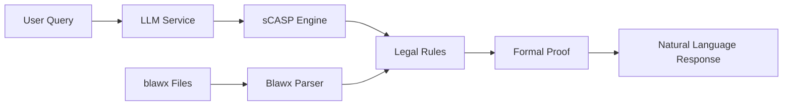

# Legal AI Assistant

> *A ChatGPT-like interface for legal queries with **guaranteed accuracy** through formal verification using s(CASP) logic programming.*

## **Core Value Proposition**

Unlike traditional AI chatbots that can "hallucinate" or provide incorrect legal advice, this system **formally verifies every answer** against structured legal rules, providing:

- **Guaranteed Accuracy**: Every response backed by formal logic proofs
- **Source Citations**: Direct links to specific legal provisions  
- **Confidence Scoring**: Transparent certainty levels (0-100%)
- **Deep Document Analysis**: Comprehensive breakdown of legal texts
- **Natural Language**: Complex legal concepts explained simply

---

## **Core Concepts Explained**

### **What is s(CASP)?**
**s(CASP)** (***s***tochastic ***C***onstraint ***A***nswer ***S***et ***P***rogramming) is a formal logic programming paradigm that:

- **Proves statements mathematically** rather than just predicting them
- **Handles uncertainty** through probabilistic reasoning
- **Provides explanations** for every conclusion
- **Guarantees soundness** - if it says something is true, it IS true

**Example**: Instead of an AI guessing "Yes, you can access those records", s(CASP) **proves** it by showing the logical chain: `citizen(X) ∧ government_record(Y) → access_right(X,Y)`

### **What is SWI-Prolog?**
**SWI-Prolog** is the underlying logic programming engine that:

- **Executes logical queries** against rule databases
- **Performs automated reasoning** through resolution and unification
- **Generates proofs** that can be traced and verified
- **Handles complex relationships** between legal concepts

Think of it as a "mathematical reasoning engine" that can prove legal conclusions the same way mathematicians prove theorems.

### **What are .blawx Files?**
**.blawx files** are structured legal documents that contain:

- **Legal Provisions**: Original legal text (human-readable)
- **s(CASP) Rules**: Formal logic representation (machine-executable)  
- **Relationships**: Connections between legal concepts
- **Metadata**: Section numbers, categories, citations

**Example transformation**:
```
Legal Text: "A Canadian citizen may request access to government records"
s(CASP) Rule: access_right(Person, Record) :- canadian_citizen(Person), government_record(Record)
```

---

## **Quick Start with GitHub Codespaces**

The fastest way to get started! Click the button below to open this project in GitHub Codespaces with everything pre-configured:

[](https://codespaces.new/wmoussa-gc/legal-ai-assistant)

### **What You Get Instantly:**
- **Pre-configured Development Environment**: SWI-Prolog, Python, Node.js all installed
- **VS Code Extensions**: Python, TypeScript, Docker, and Prolog support
- **Port Forwarding**: Automatic HTTPS URLs for your services
- **Environment Setup**: Ready-to-use development containers

### **Codespace Setup (30 seconds):**

1. **Open in Codespaces** → Click the badge above or create from GitHub
2. **Add Azure OpenAI Keys** → Set your secrets in Codespace settings:
   ```
   AZURE_OPENAI_API_KEY=your_azure_api_key_here
   AZURE_OPENAI_ENDPOINT=your_azure_endpoint_here
   AZURE_OPENAI_API_VERSION=2024-02-15-preview
   AZURE_OPENAI_DEPLOYMENT_NAME=your_deployment_name
   ```
3. **Start Services** → Run in the terminal:
   ```bash
   ./setup.sh
   ```

4. **Access Your App** → Codespaces will show you the URLs:
   - 🌐 **Frontend**: `https://[codespace-name]-3000.app.github.dev`
   - 🔧 **Backend API**: `https://[codespace-name]-8000.app.github.dev`
   - 📚 **API Docs**: `https://[codespace-name]-8000.app.github.dev/docs`

### **Development Commands:**
```bash
# Quick commands (use our dev script)
./dev.sh start      # Start all services
./dev.sh stop       # Stop all services  
./dev.sh logs       # View logs
./dev.sh check      # Check service health

# Manual Docker commands
docker-compose up -d              # Start in background
docker-compose logs -f            # Follow logs
docker-compose down               # Stop services
```

### **Adding API Keys in Codespaces:**

1. Go to your Codespace settings: `https://github.com/settings/codespaces`
2. Click **"New secret"** and add:
   - Name: `AZURE_OPENAI_API_KEY`, Value: `your_azure_openai_api_key`
   - Name: `AZURE_OPENAI_ENDPOINT`, Value: `your_azure_openai_endpoint`
   - Name: `AZURE_OPENAI_API_VERSION`, Value: `2024-02-15-preview`
   - Name: `AZURE_OPENAI_DEPLOYMENT_NAME`, Value: `your_deployment_name`
3. Restart your Codespace for changes to take effect

> **💡 Tip**: Codespace secrets are more secure than `.env` files and work automatically across all your codespaces.

---

### **System Architecture Overview**



1. **User asks a legal question** in natural language
2. **Azure OpenAI GPT-4** converts it to formal logic query
3. **s(CASP) engine** searches legal rule database
4. **SWI-Prolog** generates mathematical proof
5. **System returns verified answer** with confidence score

---

### **Installation**

#### **1. Clone the Repository**
```bash
git clone <your-repo-url>
cd legal-ai-assistant
```

#### **2. Backend Setup**

**macOS/Linux:**
```bash
cd backend
python3 -m venv venv
source venv/bin/activate
pip install -r requirements.txt
```

**Windows:**
```powershell
cd backend
python -m venv venv
venv\Scripts\activate
pip install -r requirements.txt
```

#### **3. Frontend Setup**

**Both Platforms:**
```bash
cd ../frontend
npm install
```

#### **4. Environment Configuration**

Create `.env` file in `/backend/`:
```env
# Azure OpenAI Configuration (Required for full functionality)
AZURE_OPENAI_ENDPOINT=your_endpoint_here
AZURE_OPENAI_API_KEY=your_api_key_here
AZURE_OPENAI_DEPLOYMENT_NAME=your_deployment_name
AZURE_OPENAI_API_VERSION=2024-02-15-preview

# Optional: Debug settings
DEBUG=true
LOG_LEVEL=info
```

#### **5. Start the Applications**

**Backend** (in `/backend/` directory):
```bash
# macOS/Linux
source venv/bin/activate
uvicorn app.main:app --reload --host 0.0.0.0 --port 8000

# Windows  
venv\Scripts\activate
python -m uvicorn app.main:app --reload --host 0.0.0.0 --port 8000
```

**Frontend** (in `/frontend/` directory):
```bash
npm start
```

Open http://localhost:3000 to use the application!


## **Key Features Deep Dive**

### **Document Analysis**
- **Provision Breakdown**: View all legal provisions with metadata
- **Rule Statistics**: Count facts, rules, predicates, variables
- **Sample Rules Display**: See actual s(CASP) logic with syntax highlighting
- **Interactive Tabs**: Navigate between Overview, Provisions, and Rules Analysis

### **Intelligent Chat Interface**
- **Streaming Responses**: Real-time answer generation
- **Confidence Scores**: Transparent uncertainty (e.g., "90% confident")
- **Source Citations**: Direct links to legal provisions
- **Natural Language**: Complex legal concepts explained simply

### **Formal Verification Engine**
- **Mathematical Proofs**: Every answer backed by formal logic
- **Query Processing**: Natural language → Logic → Verified Answer
- **Explanation Generation**: Shows reasoning steps

### **System Status Monitoring**
- **Health Checks**: Real-time service status
- **Document Stats**: Loaded documents and rule counts
- **Performance Metrics**: Query processing times

---

## **Usage Examples**

### **Example 1: Access to Information Query**
```
User: "Can a Canadian citizen request records from Health Canada?"

System Response: 
✅ Yes, with 95% confidence

Legal Basis:
- Access to Information Act, Section 4(1)
- Canadian citizenship establishes right of access
- Health Canada is a government institution under the Act

s(CASP) Proof:
canadian_citizen(john) ∧ government_institution(health_canada) 
→ access_right(john, health_canada_records)
```

### **Example 2: Wills and Estates Query**  
```
User: "What are the requirements for a valid will in this jurisdiction?"

System Response:
✅ A valid will requires (90% confidence):

1. Testator must be of sound mind (Wills Act s.3)
2. Will must be in writing (Wills Act s.5) 
3. Signed by testator (Wills Act s.7)
4. Witnessed by two persons (Wills Act s.8)

s(CASP) Verification: ✓ All requirements formally verified
```


### **Adding New Legal Documents**

1. **Obtain .blawx file** with legal provisions and s(CASP) rules
2. **Place in `/data/` directory**
3. **Restart backend** - documents auto-load on startup
4. **Verify in browser** - check Document List for new document

### **Extending Query Capabilities**

1. **Add s(CASP) rules** to .blawx files for new legal concepts
2. **Update LLM prompts** in `llm_service.py` for better query understanding  
3. **Test queries** through the chat interface

### **API Endpoints**

- `GET /health` - System status and loaded documents
- `GET /documents` - List all loaded legal documents  
- `GET /documents/{slug}/details` - Detailed document analysis
- `POST /query` - Process legal queries with formal verification


## **License**

This project is licensed under the MIT License - see the [LICENSE](LICENSE) file for details.


## **Acknowledgments**

- **s(CASP) Team** - Formal logic programming framework
- **SWI-Prolog** - Logic programming engine
- **Blawx Project** - Legal rule structuring methodology  
- **Azure OpenAI** - Natural language processing capabilities

---

**Built with precision for legal professionals who demand accuracy over approximation.**